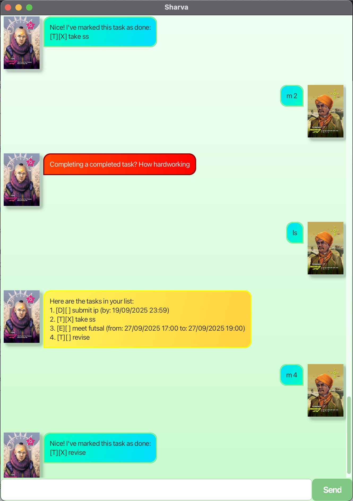

# Sharva User Guide

## Overview

Sharva is a powerful yet simple task management chatbot built with Java and JavaFX.
It helps you efficiently manage your daily tasks through a clean text-based chat interface with a graphical UI.
Sharva provides an effective solution for organizing todos, deadlines, and events.

## QuickStart
1. Ensure that you have Java `17` installed
2. Download the latest `Sharva.jar` from the [releases]();
3. Copy the file to a new folder
4. Run the file using the following command. A GUI similar to below should appear.
```
java -jar Sharva.jar
```


## Features
- **Task Management**: Add, delete, mark/unmark, list, and search tasks with ease.
- **Persistent Storage**: All tasks are automatically saved to a text file, so your data is never lost between sessions.
- **Graphical User Interface (GUI)**: A clean and simple JavaFX interface for more intuitive interaction.
- **Command Overview**: Supports creating To-Do, Deadline, and Event tasks, along with task search and organization tools.


## Commands
Sharva can do the following

- Add To-Do, Deadline, and Event tasks
- List all tasks
- Mark tasks as done
- Unmark tasks as not done
- Delete tasks
- Find tasks by keyword
- Exit the program

### Adding To-Do task
Adds a basic To-Do task

**Format**:
`todo <taskName>`
or
`t <taskName>`

**Example**:
```
todo finish Maths HW
t finish Maths HW
```
### Adding Deadline task
Adds a task with a deadline

**Format**:
`deadline <taskName> /by <deadline>` 
or
`d <taskName> /by <deadline>`

**Example**:
```
deadline finish Science HW /by 270925 17:00
d finish Science HW /by 27/9/25 5pm
deadline finish Science HW /by 27/09/25 5.00 pm
```
### Adding Event task
Adds an Event task that has a start time and end time

**Format**:
`event <taskName> /from <start> /to <end>`
or
`e <taskName> /from <start> /to <end>`

**Example**:
```
event project /from 120325 /to 120425
e project /from 120325 0000 /to 120425 2359
event project /from 12/3/25 /to 12/4/25
```
### Marking task as done
Marks a selected task based on index

**Format**:
`mark <index>`
or
`m <index>`

**Example**:
```
mark 1
m 1
```
### Unmarking task as not done
Unmarks a selected task based on index

**Format**:
`unmark <index>`
or
`u <index>`

**Example**:
```
unmark 1
u 1
```
### Deleting Tasks
Deletes a selected task based on index

**Format**:
`delete <index>`
or
`del <index>`

**Example**:
```
delete 2
del 2
```
### Finding tasks by keyword
Filters task by keyword

**Format**:
`find <keyword>`
or
`f <keyword`

**Example**:
```
find maths
f Maths
```
### Exiting the program
Exits the program

**Format**:
`bye`

**Example**:
```
bye
```


